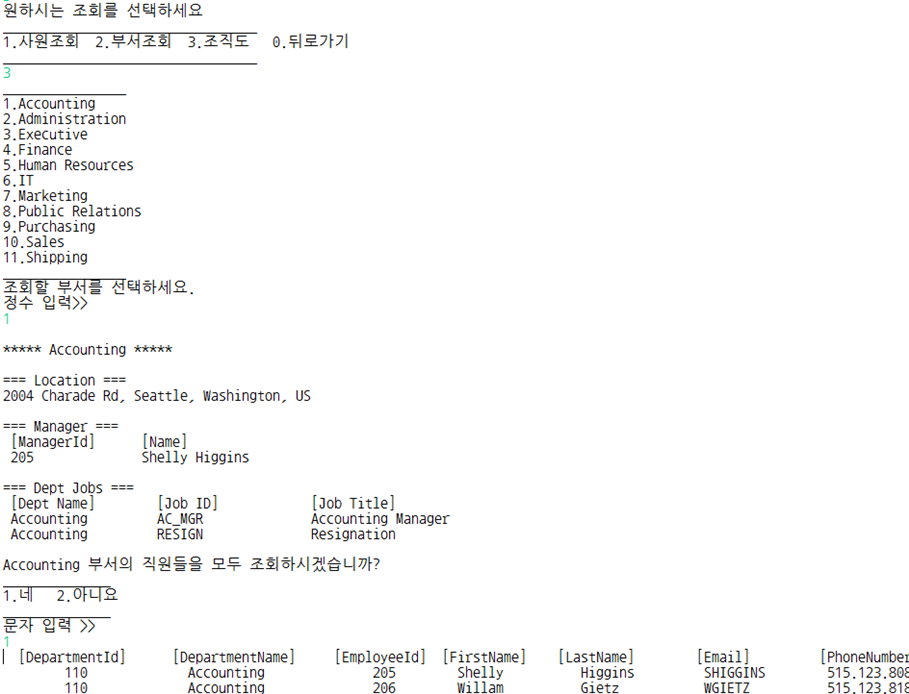

# HR 인사관리 프로그램

- Presentation 영상 : [발표영상](https://github.com/jaelyung/HRManagement)

- 개발환경 - Java, Oracle

- 프로젝트 개요 : 인사 담당자를 중심으로 한 사원관리 프로그램. 관리자는 사원들의 모든 정보를 등록, 수정, 삭제할 수 있으며 

일반사원들은 민감정보(급여 등)을 제외한 정보조회가 가능함

# Service

- 메인메뉴 선택

- 관리자 로그인 및 메뉴별 데이터 등록, 수정, 삭제, 조회 업무

- 관리자 신규사원 등록 업무

- 관리자 급여 조회 중 범위 조회 업무

- 일반 사원 조직도 조회

